# 📊 AccuraERP - Professional Accounting Software

A comprehensive, multi-theme **Double-Entry Accounting System** built with **Django** and **Bootstrap 5**. Designed for seamless financial management with automated balancing, real-time analytics, and accurate financial reporting.

[](https://www.python.org/)
[](https://www.djangoproject.com/)
[](https://getbootstrap.com/)
[](LICENSE)

---

## 🚀 Key Features

- **🎨 5+ Dynamic Themes:** Instantly switch between **Light, Dark, Green, Blue, and Purple** modes.
- **⚡ Smart Auto-Balance:** Press `Alt + B` to automatically calculate and fill Debit/Credit differences.
- **📑 Financial Reports:** Generate real-time **Income Statement, Balance Sheet, and Trial Balance**.
- **📚 Advanced General Ledger:** Track every transaction with detailed drill-down views.
- **🎹 Accountant-Friendly:** Full keyboard support (`Ctrl+Enter` to Post, `Alt+N` for New Line).
- **🔐 Secure Authentication:** Modern, animated Login & Registration system.
- **📱 Fully Responsive:** Optimized for Mobile, Tablet, and Desktop.

---

## 📸 Project Tour

### 1️⃣ Stunning Multi-Theme Dashboard
*Users can customize their experience with 5 different color themes. The dashboard provides a real-time financial overview.*

**Light Mode Overview**
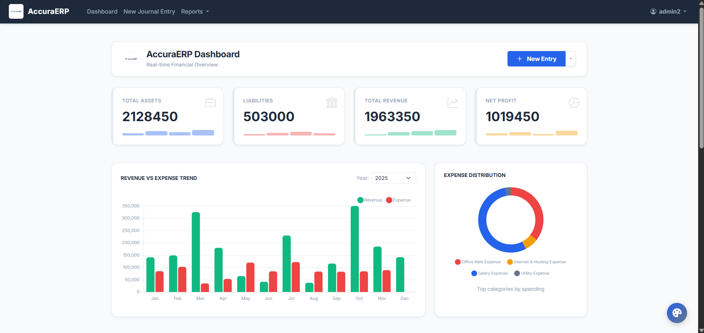

| **Purple Mode** | **Green Mode** |
|:---:|:---:|
| 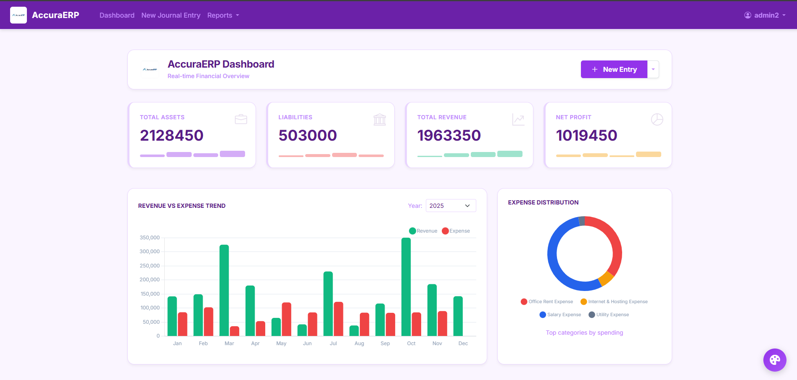 | 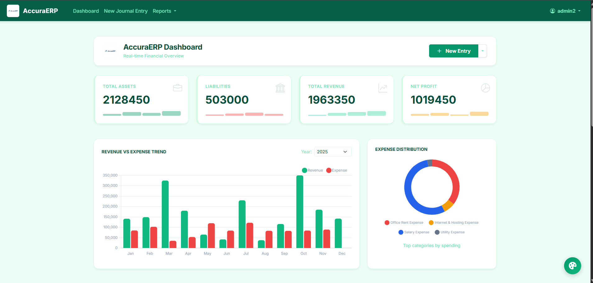 |

| **Dark Mode** | **Blue Mode** |
|:---:|:---:|
| 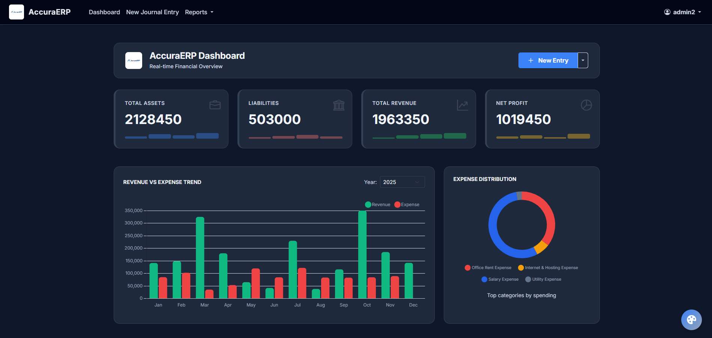 | 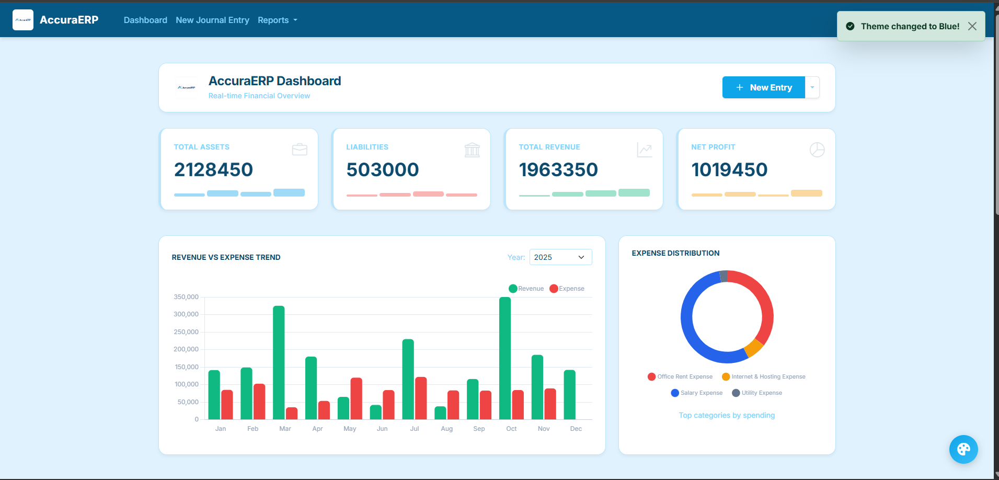 |

---

### 2️⃣ Modern Authentication
*Secure and animated entry points for users.*

| **Login Page** | **Register Page** |
|:---:|:---:|
| 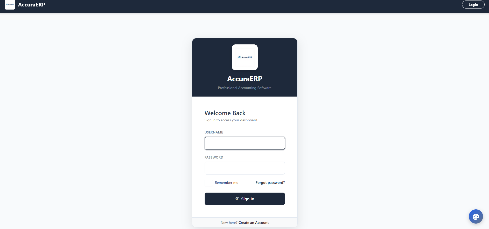 | 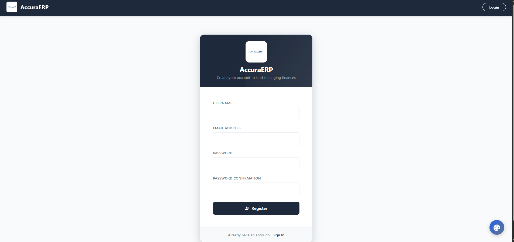 |

---

### 3️⃣ Journal Entry Management
*The core input module. Manage daily transactions with auto-balancing and shortcuts.*

**Create Journal Entry (With Auto-Balance Feature)**
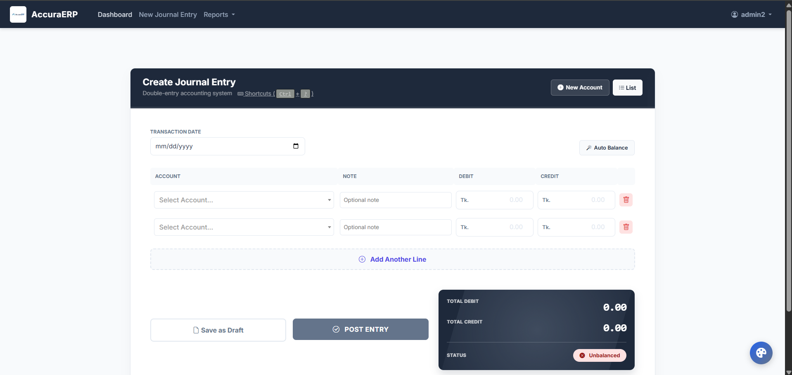

**Journal Entries List (Draft vs Posted)**
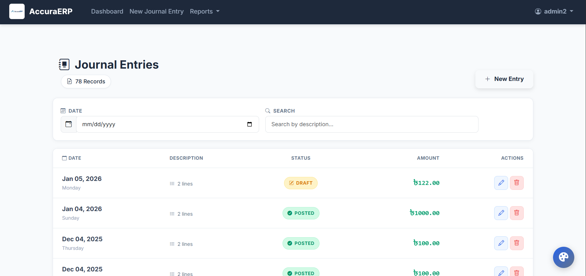

**Quick Account Creation Modal**
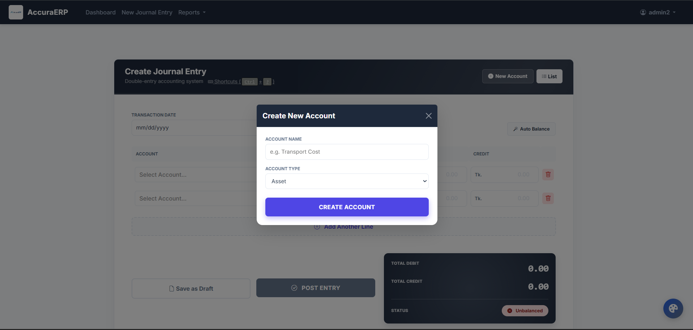

---

### 4️⃣ Ledgers & Chart of Accounts
*Track and monitor account balances in real-time.*

**Chart of Accounts Management**
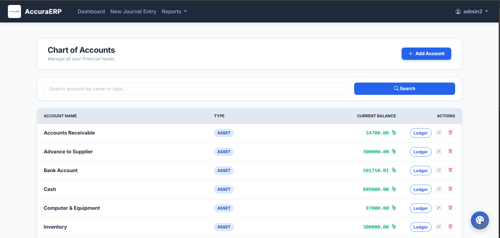

**Ledger Overview Dashboard**
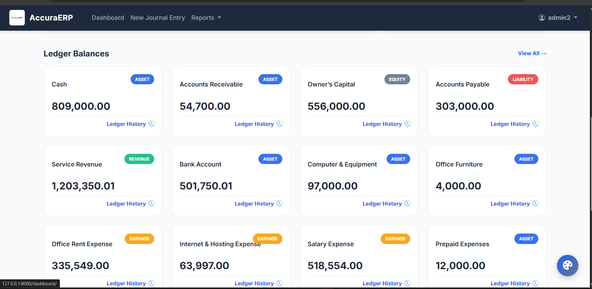

**Individual Account Ledger**
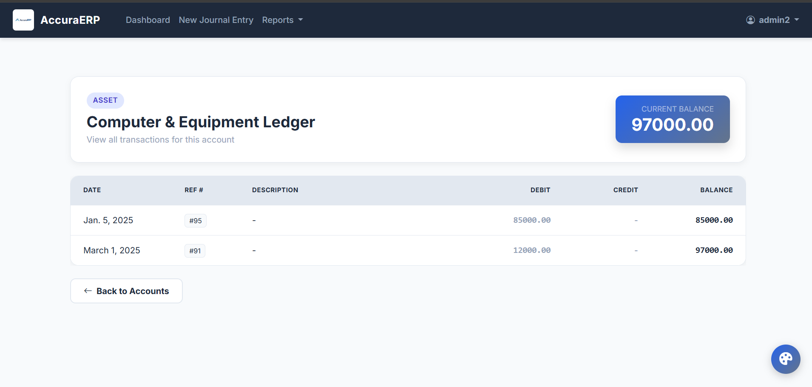

---

### 5️⃣ Financial Reporting
*Automated generation of key financial statements (The Final Output).*

**Trial Balance Overview**
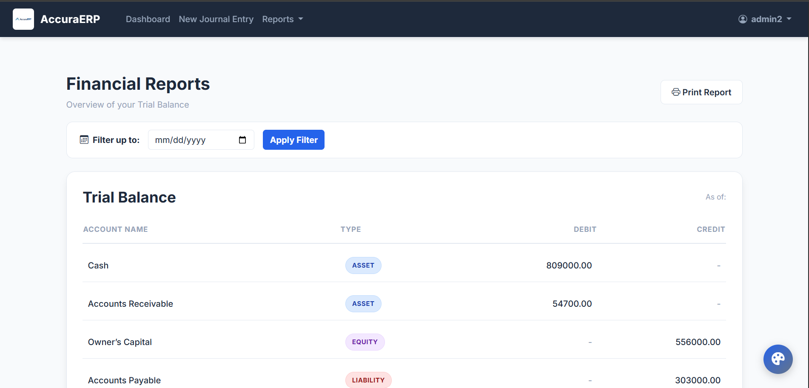

| **Income Statement (P&L)** | **Balance Sheet** |
|:---:|:---:|
| 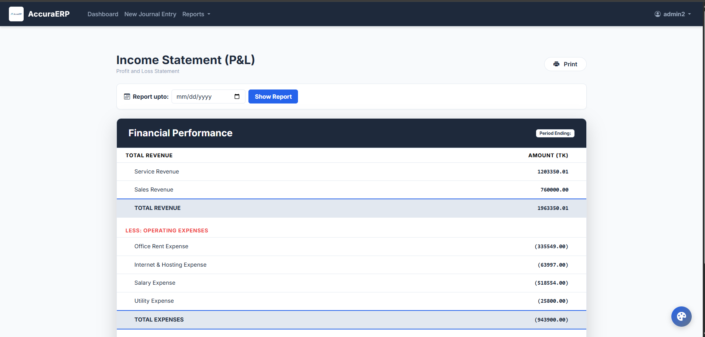 | 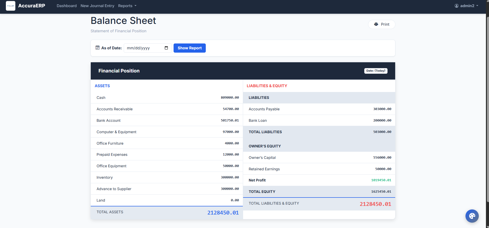 |

---

## 🛠️ Installation Guide

Follow these steps to run the project locally:

1. **Clone the repository:**
   ```bash
   git clone https://github.com/farhananowshin/Web-based-accounting-software.git
   cd Web-based-accounting-software
